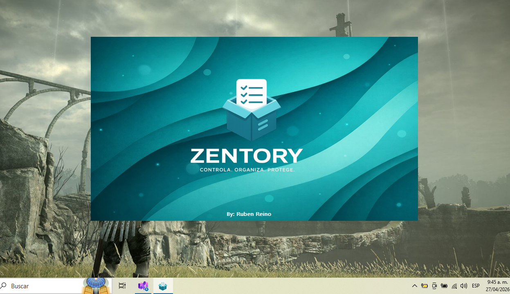
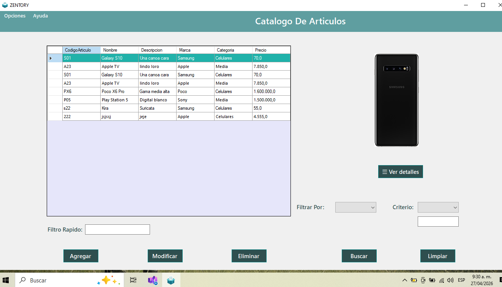
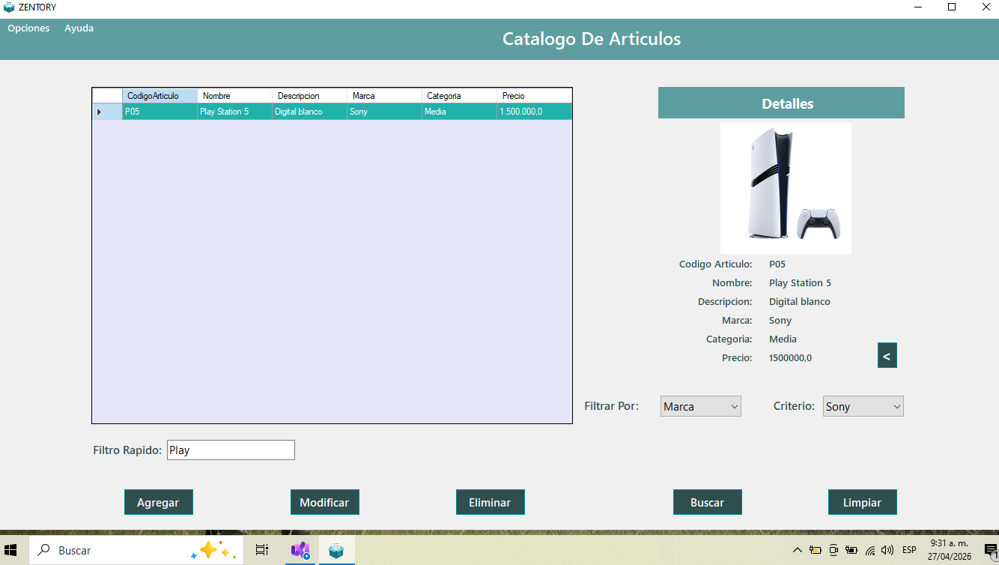
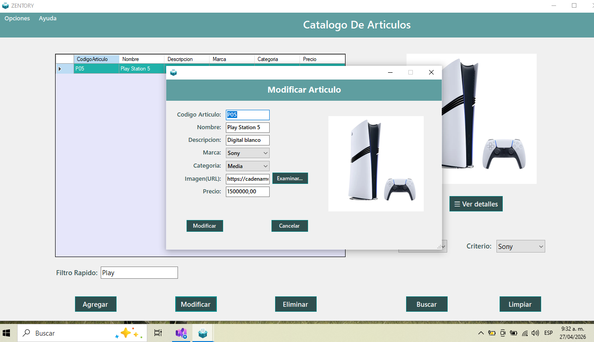

#  ZENTORY

Aplicación de escritorio desarrollada en C# con WinForms para la gestión de inventarios. Permite administrar productos, controlar stock y gestionar información almacenada en base de datos.

---

##  Funcionalidades

- Crear, editar y eliminar productos (CRUD completo)  
- Visualización de inventario en tiempo real  
- Filtros de búsqueda  
- Validación de datos en formularios  
- Visualización detallada de productos  

---

##  Tecnologías utilizadas

- C#  
- .NET  
- WinForms  
- SQL Server  

---

##  Capturas de pantalla

---

##  Cómo ejecutar el proyecto

1. Clonar el repositorio  
2. Abrir la solución en Visual Studio  
3. Configurar la conexión a SQL Server  
4. Ejecutar el proyecto  

---

##  Autor

Rubén Reino  
GitHub: https://github.com/RubenReino  
LinkedIn: https://linkedin.com/in/rubenreino
